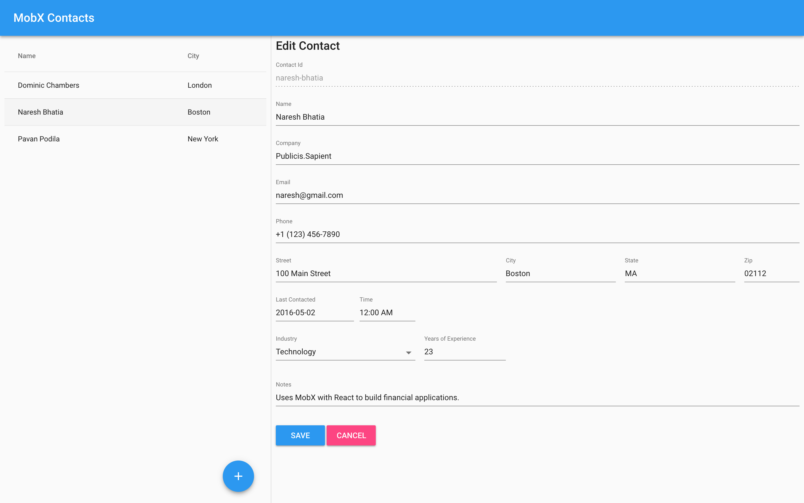

MobX Contacts
=============



Getting started
---------------
```bash
$ npm install <--- substitute with yarn if you prefer it
$ npm start
```

Now point your browser to http://localhost:3000/.

Patterns Implemented
--------------------
1. Master-Detail UI Pattern: See core/components/master-detail
2. Form validation: See contacts/contact-form.jsx, core/components/form
3. Observable View Models: See contacts/models/contact.js
4. Persistence using Firebase: See core/utils/firebase-map.js
